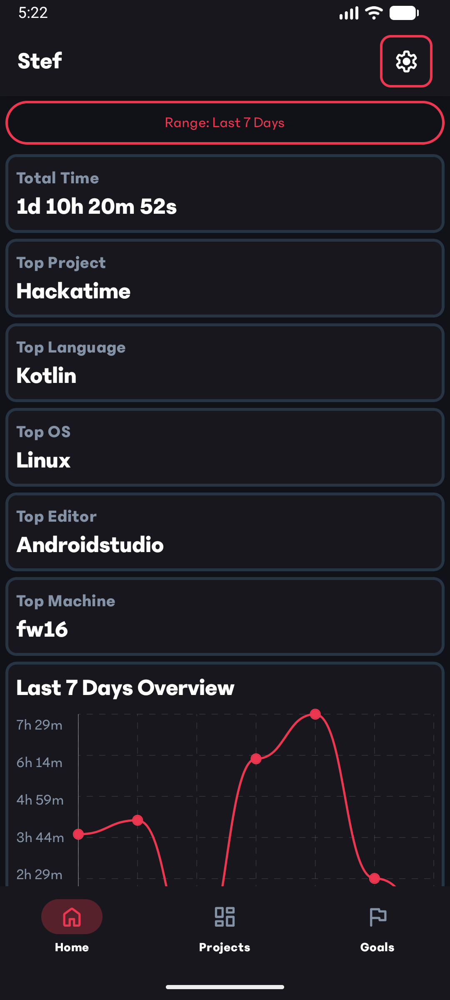
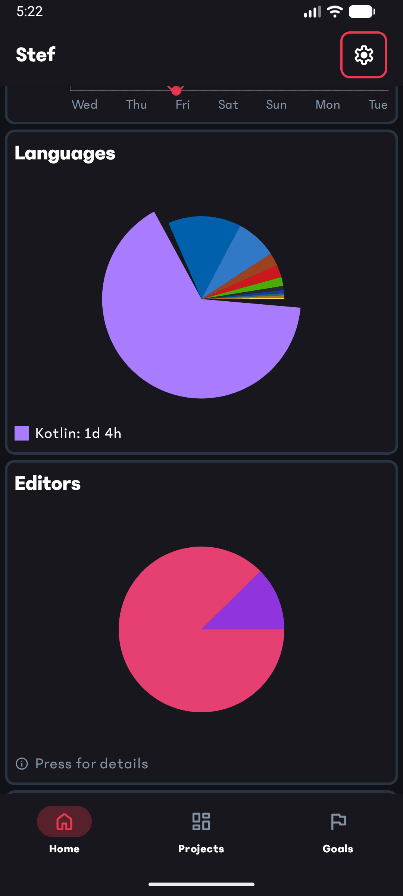
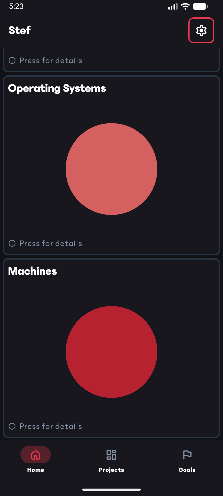
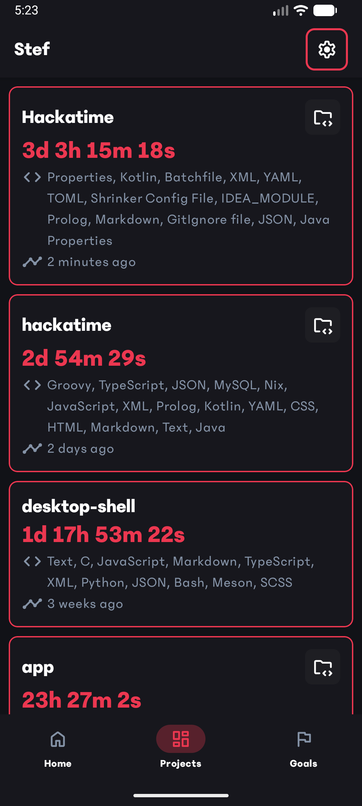
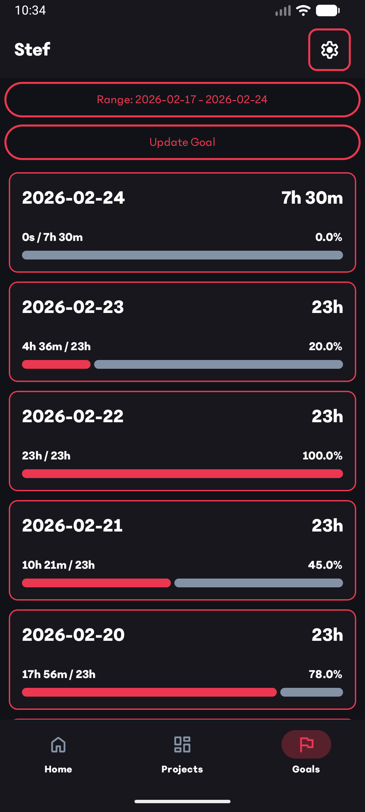
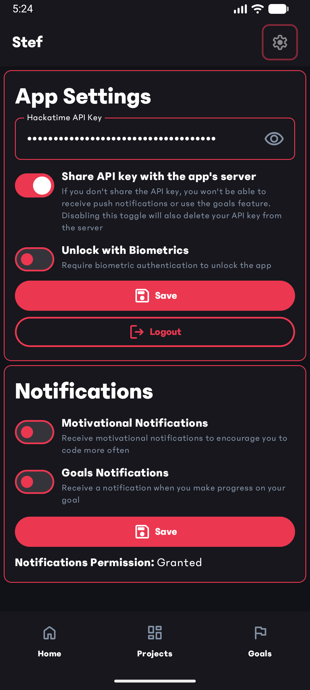
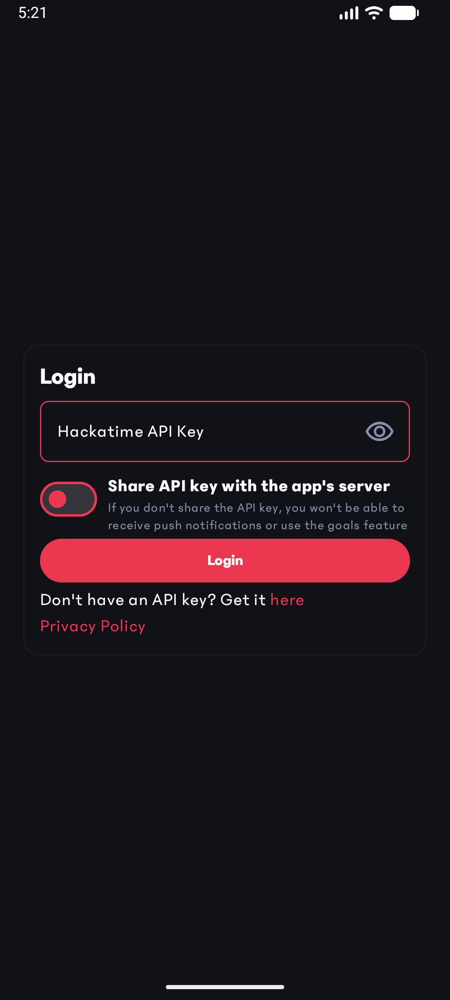
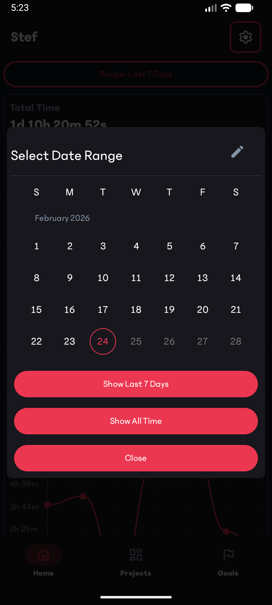
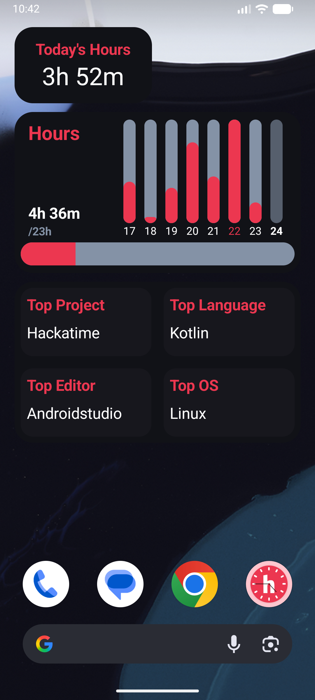
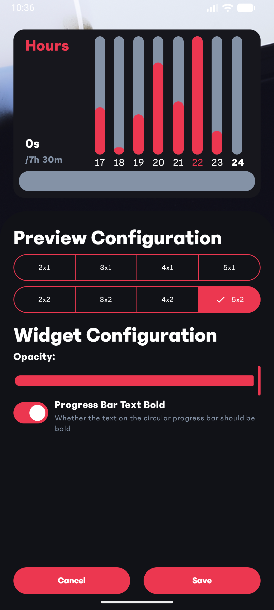

# Hackatime Android App

> [!IMPORTANT]
> iOS is not supported

This is an android app made to view your [Hackatime](https://hackatime.hackclub.com) data.

# Features

- View your time, top language and top project for any range
- View your top editor, top OS and top machines when the range is set to "Last 7 Days"
- View your projects
- Lock the app behind biometric authentication
- Widgets
- Motivational Push Notifications

# Images

Click here to view the app's images

<table>
    <tr>
        <td></td>
        <td></td>
        <td></td>
    </tr>
    <tr>
        <td></td>
        <td></td>
        <td></td>
    </tr>
    <tr>
        <td></td>
        <td></td>
        <td></td>
    </tr>
    <tr>
        <td></td>
    </tr>
</table>

# Download

The app is available on the following platforms:
- Google Play Store
- GitHub Releases

# Creating a development build

> [!NOTE]
> The build will fail unless you have a `google-services.json` file obtained from firebase in the `app/` folder

To create a development build just run `./gradlew assembleDebug` or use the Android Studio Emulator

This will create an APK in `app/build/outputs/apk/debug/app-debug.apk`

> Building an APK

just run `./gradlew assembleRelease`

This will create an APK in `app/build/outputs/apk/release/app-release(-unsigned).apk`